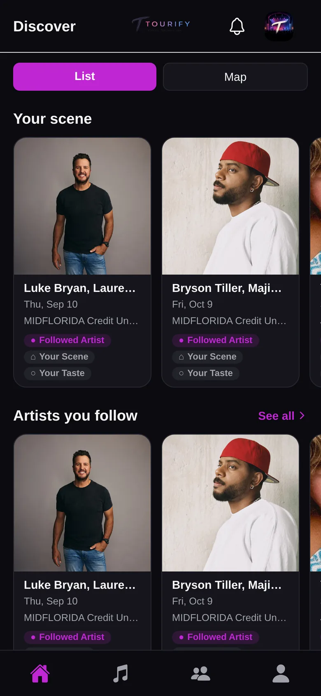
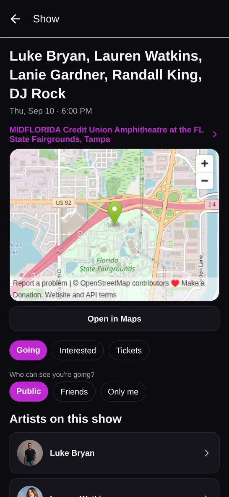
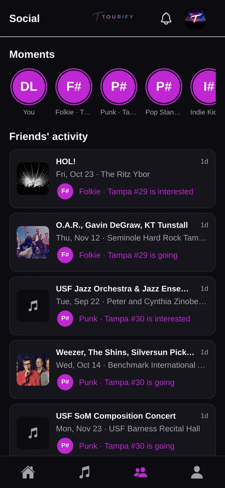

# Tourify

A live-music tour finder. Set a home base and your favourite bands, then see who's
touring nearby, discover shows through the people you know, and go together.

The source is private. These are the working design documents — the reasoning behind
the architecture, the data model, and the decisions that shaped it.

**[Try the live demo →](https://tourify-j82w.vercel.app)**
Sign in with **Explore the demo** for a seeded account: real venues, real upcoming
shows, a populated social graph.

<div class="shots">
  <figure>
    <a href="img/discover.webp" target="_blank" rel="noopener noreferrer"></a>
    <figcaption><strong>Discover</strong> — every card carries its reason: a band you follow,
    your scene, or your taste. Nothing appears without one.</figcaption>
  </figure>
  <figure>
    <a href="img/show.webp" target="_blank" rel="noopener noreferrer"></a>
    <figcaption><strong>A show</strong> — full lineup, venue, and going/interested with
    per-item visibility: public, friends, or only you.</figcaption>
  </figure>
  <figure>
    <a href="img/social.webp" target="_blank" rel="noopener noreferrer"></a>
    <figcaption><strong>Social</strong> — moments from the last day, over a feed of what
    friends are going to.</figcaption>
  </figure>
</div>

## The problem

Tour data is fragmented and stale. Ticketmaster covers arenas well and clubs badly.
An artist you follow announces a date, and you find out after it sells out — or never.
Meanwhile the friend who would have gone with you had the same problem.

Tourify treats that as two distinct jobs: **follow the bands you already love**, and
**find the scene around you** through venues, similar artists, and the people you go
to shows with.

## Shape of the system

```
app/        Expo (React Native) — iOS, Android, web
backend/    FastAPI modular monolith
            Postgres + PostGIS for radius search
            APScheduler worker for event sync and alert evaluation
```

The pieces that took the most thought, and where to read about them:

- **Why the sync strategy is hybrid** rather than one pass over everything —
  [technical decisions](technical-decisions.html), TD-2
- **Why an empty Discover screen was never acceptable**, and what fills it on a cold
  start — TD-3
- **How the same show arriving from two ticketing feeds gets reconciled** rather than
  duplicated — TD-10
- **How artist identity is anchored** across sources that disagree about names — TD-4
- **Why radius search is PostGIS geography** and not arithmetic on lat/lng —
  [database](database.html)

## Reading order

Start with [vision](vision.html) for what the product is trying to be, then
[architecture](architecture.html) for how it's put together, then
[technical decisions](technical-decisions.html) for the reasoning that constrained
both.
